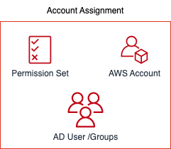
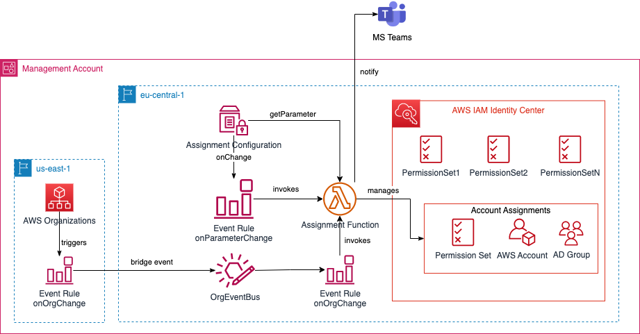
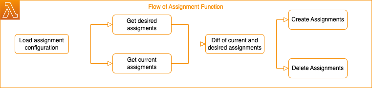

# AWS IAM Identity Center - Permsission Sets and Assignments

[](https://docs.aws.amazon.com/cdk/v2/guide/home.html)
[](https://docs.aws.amazon.com/cdk/v2/guide/home.html)


- [AWS IAM Identity Center - Permsission Sets and Assignments](#aws-iam-identity-center---permsission-sets-and-assignments)
  - [Overview](#overview)
  - [Architecture](#architecture)
    - [Permission Sets](#permission-sets)
    - [Configure Assignments](#configure-assignments)
    - [Automation of Management for Account Assignments](#automation-of-management-for-account-assignments)
  - [Rollout / Deployment](#rollout--deployment)
    - [Requirements](#requirements)
    - [Deployment](#deployment)

## Overview
This CDK project contains all resources relating to automation of permission management for human users via the AWS IAM Identity Center service (formerly AWS SSO). With AWS IAM Identity Center, authentication and authorisation were realised via identities from the identity pool configured in AWS IAM Identity Center.

In the project, the required policies are provisioned in so-called **Permission Sets** and rolled out to the desired accounts via automation. This rollout is also called **assignment** in the AWS IAM Identity Center. An assignment consists of:

- Permission Set (with the desired IAM Policy for the IAM Role)
- AD Group
- AWS Account



In the provided solution, only AD groups are used in assignments.

## Architecture


The CDK stack first rolls out the permission sets that have been created. In addition, a Lambda function is deployed that takes care of the automated management of the assignments. There is a configuration for this, which is stored in a ParameterStore parameter. The function is triggered by event rules from AWS EventBridge. If an assignment is created/deleted successfully or incorrectly, a message is sent to an MS Teams channel configured via Webhook.

The individual components are described below.

### Permission Sets

A permission set is basically a set of managed and custom IAM policies, which you can assign to a user/group in an account. In the `lib/permission-sets-stack.ts` file you will some examples for provisioning permission sets in the managment account.

### Configure Assignments

The configuration for assignments is in the values file. This is the core for automating the management of assignments. Currently, an AD domain is supported for the AD groups. This must be specified via the `ADDomain` property. The configuration contains the following configuration sections:

- `GlobalAssignments` For assignments of PermissionSets that are required in all accounts.
- `OuAssignments` For assignments of PermissionSets required in accounts of a specific OU.
- `AccountAssignments` For assignments of PermissionSets that are required in specific accounts.

Example:

```javascript
AssignmentConfiguration: {
    AdDomain: "yourorg.com",
    GlobalAssignments: [
      {
        AdGroupName: "AD-GROUP-CLOUD-ADMINS",
        PermissionSet: "MyRole1PermissionSet"
      }
    ],
    OuAssignments: [
      {
        OuName: "FinanceUnit",
        Assignments: [
          {
            AdGroupName: "AD-GROUP-FINANCE-OPS",
            PermissionSet: ""
          }
        ]
      }
    ],
    AccountAssignments: [
      {
        AccountName: "MyOrgSecurityAccount",
        Assignments: [
          {
            AdGroupName: "AD-GROUP-SEC_AUDIT",
            PermissionSet: ""
          }
        ]
      }
    ]
  }
```
The `GlobalAssignments` section is an array that requires the PermissionSet name and the AD group name per entry (**without** domain name).

For the `OuAssignments`, one array entry is displayed per OU (OrganisationalUnit), which contains another array with the assignments. The `OuName` must be entered here.

For the `AccountAssignments`, one array entry is displayed per OU (OrganisationalUnit), which contains another array with the assignments. The `AccountName` must be entered here.


### Automation of Management for Account Assignments

The automation of the management of account assignments is realised via a Lambda function `AssignmentFunction`. The function is triggered by the following event rules of AWS EventBridge:

- Change in the parameter (and thus the configuration)
- Change in the AWS organisation (account creation, account deletion, new OU creation, etc.).

Thus, any change in the assignment configuration or change in the AWS Organisation can trigger an update of the assignments. The Lambda function works as follows:



- First, the configuration is loaded from the parameter store.
- A desired list of assignments is created from the configuration (desired assignments).
- An actual list of assignments is created (current assignments).
- From both lists, the assignments to be created and deleted are determined.
- All desired Assignments will be created
- All desired Assignments will be deleted

Since the deletion/creation of assignments runs asynchronously, each assignment is deleted one after the other and the status is checked via a separate SDK call. Only when the status is no longer `IN_PROGRESS` is the next assignment created.

## Rollout / Deployment

### Requirements

- `task` to run the different tasks specified in `Taskfile.yml`
- `aws` CLI Version 2.x
- `cdk` Version 2.x
- `jq` is used by `task`
- `docker` or `esbuild` for Transpiling the Lambda Function

### Deployment

For deployment, a valid session must first exist in the management account for your shell. Deployment then is initiated via:

```
task deploy
```

You can configure this project with e.g. `sample.ts` in folder `values`.